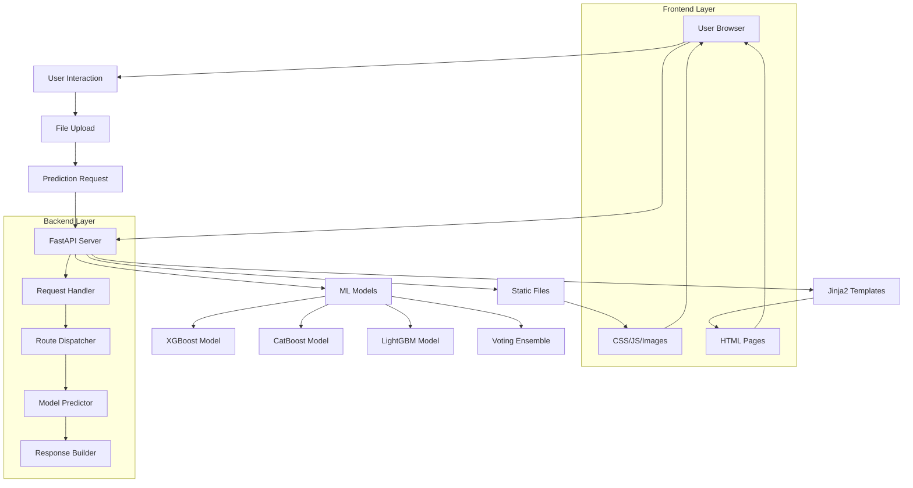
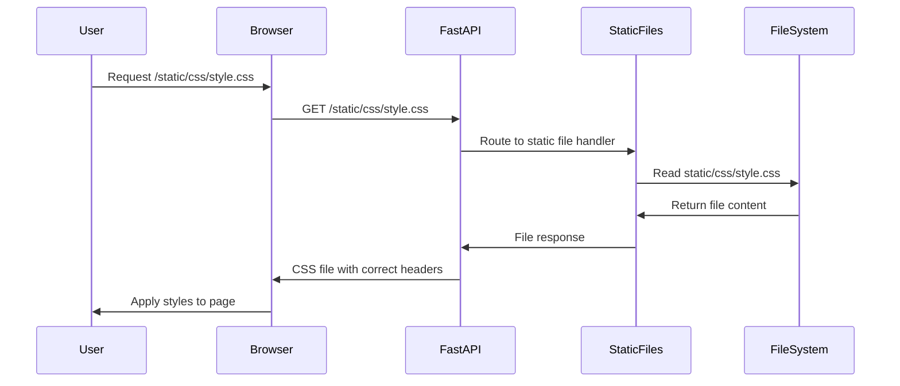
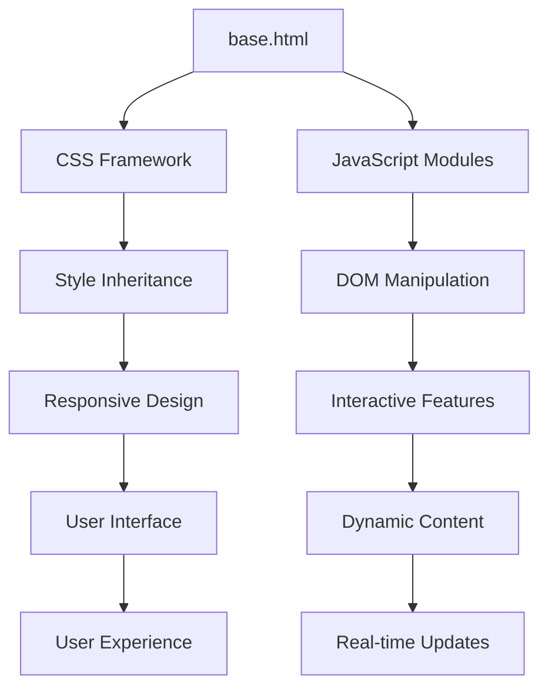
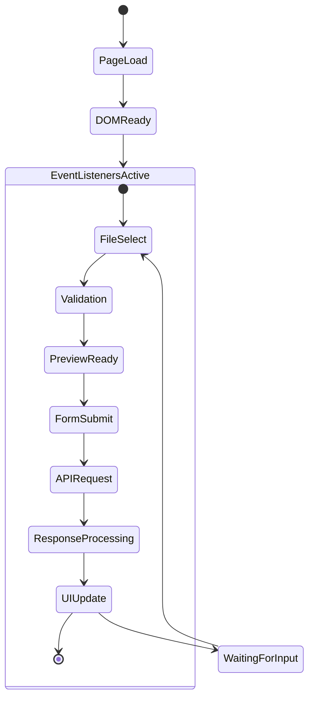
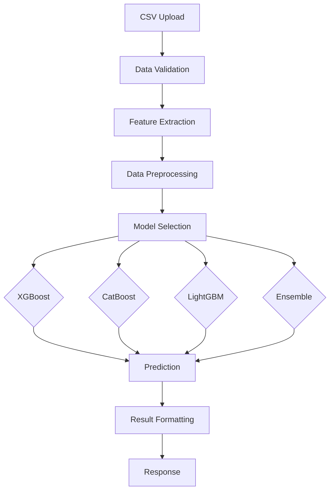
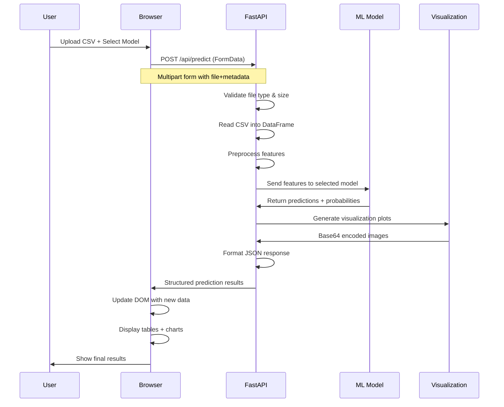
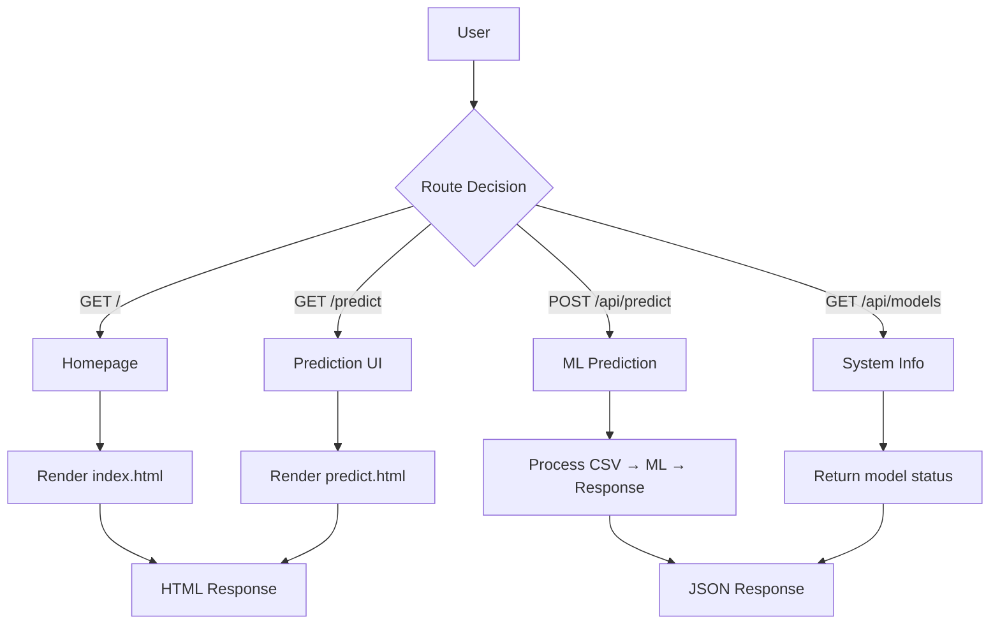
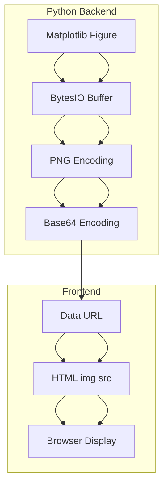
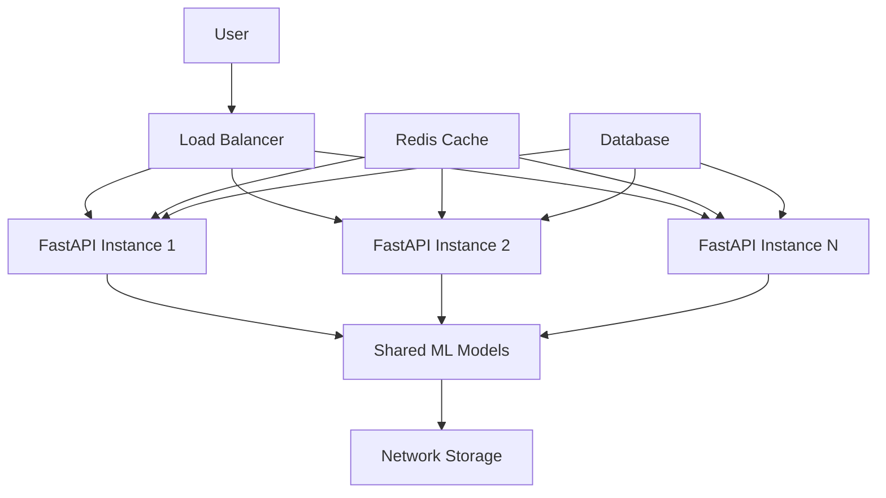

# 🌌 Exoplanet Detection System - Complete Technical Documentation

## 📖 Table of Contents
1. [Architecture Overview](#architecture-overview)
2. [FastAPI Backend Deep Dive](#fastapi-backend-deep-dive)
3. [Frontend Integration](#frontend-integration)
4. [Machine Learning Pipeline](#machine-learning-pipeline)
5. [Real-time Data Flow](#real-time-data-flow)
6. [API Routes & Schemas](#api-routes--schemas)
7. [Visualization System](#visualization-system)
8. [Deployment & Scaling](#deployment--scaling)

---

## 🏗️ Architecture Overview

### System Architecture Diagram



### Technology Stack
```
Frontend: HTML5 + CSS3 + Vanilla JavaScript
Backend: FastAPI + Python 3.9+
ML Framework: XGBoost, CatBoost, LightGBM, Scikit-learn
Templating: Jinja2
Data Processing: Pandas + NumPy
Visualization: Matplotlib + Seaborn
```

---

## 🚀 FastAPI Backend Deep Dive

### Application Initialization

```python
# app.py - Core FastAPI Application
from fastapi import FastAPI, Request, UploadFile, File, Form
from fastapi.staticfiles import StaticFiles
from fastapi.templating import Jinja2Templates

# ===== FASTAPI APP INITIALIZATION =====
app = FastAPI(
    title="Exoplanet Detector",
    version="1.0.0",
    description="ML-powered exoplanet detection from astronomical data"
)

# Mount static files (CSS, JS, images)
app.mount("/static", StaticFiles(directory="static"), name="static")

# Configure templates
templates = Jinja2Templates(directory="templates")
```

### How Static File Mounting Works



### Template Rendering Flow

```python
@app.get("/", response_class=HTMLResponse)
async def home(request: Request):
    """
    Theory: FastAPI injects the request object, Jinja2 renders HTML template
    Practice: Returns fully rendered HTML page with injected variables
    """
    return templates.TemplateResponse("index.html", {"request": request})
```


---

## 🌐 Frontend Integration

### HTML-CSS-JS Connection Architecture



### JavaScript DOM Management

```javascript
// static/js/predict.js - DOM Element Management
const elements = {
    // Form elements
    predictionForm: document.getElementById('predictionForm'),
    modelSelect: document.getElementById('modelSelect'),
    csvFile: document.getElementById('csvFile'),
    
    // UI sections
    previewSection: document.getElementById('previewSection'),
    loadingSpinner: document.getElementById('loadingSpinner'),
    resultsSection: document.getElementById('resultsSection')
};

// Event-driven architecture
document.addEventListener('DOMContentLoaded', function() {
    initializeEventListeners();
    validateForm();
});
```

### Event Handling System



---

## 📊 Machine Learning Pipeline

### Model Loading & Management

```python
# Global model registry
models = {}
scaler = None
feature_names = []

def load_ml_models():
    """Load all trained ML models at application startup"""
    global models, scaler, feature_names
    
    models = {
        'xgboost': joblib.load('ml_models/xgboost_model.pkl'),
        'catboost': joblib.load('ml_models/catboost_model.pkl'),
        'lightgbm': joblib.load('ml_models/lightgbm_model.pkl'),
        'ensemble': joblib.load('ml_models/voting_ensemble.pkl')
    }
    
    scaler = joblib.load('ml_models/scaler.pkl')
    feature_names = joblib.load('ml_models/feature_names.pkl')
```

### ML Model Integration Architecture



### Prediction Workflow

```python
async def predict(model_type: str, file: UploadFile):
    """
    Complete prediction pipeline:
    1. File validation → 2. Data reading → 3. Preprocessing
    4. Model prediction → 5. Result formatting → 6. Response
    """
    # 1. Validate and read CSV
    contents = await file.read()
    df = pd.read_csv(io.BytesIO(contents))
    
    # 2. Preprocess data
    X_processed = preprocess_input_data(df)
    
    # 3. Select and use model
    model = models[model_type]
    predictions = model.predict(X_processed)
    probabilities = model.predict_proba(X_processed)
    
    # 4. Format results
    return format_prediction_results(predictions, probabilities, model_type)
```

---

## 🔄 Real-time Data Flow

### Complete Request-Response Cycle



### File Upload Processing

```javascript
// JavaScript File API Integration
async function sendPredictionRequest() {
    const file = elements.csvFile.files[0];
    const modelType = elements.modelSelect.value;
    
    // Create FormData for file upload
    const formData = new FormData();
    formData.append('file', file);
    formData.append('model_type', modelType);
    
    // Send to FastAPI endpoint
    const response = await fetch('/api/predict', {
        method: 'POST',
        body: formData  // Let browser set Content-Type automatically
    });
    
    return await response.json();
}
```


---

## 🛣️ API Routes & Schemas

### Route Architecture

```python
# ===== APPLICATION ROUTES =====
@app.get("/")                    # Homepage
@app.get("/predict")             # Prediction page
@app.post("/api/predict")        # Prediction endpoint
@app.get("/api/models")          # Model info endpoint
```

### Route Purpose & Flow



### Request/Response Schemas

```python
# Prediction Request Schema (FormData)
{
    "file": UploadFile,      # CSV file
    "model_type": str        # 'xgboost' | 'catboost' | 'lightgbm' | 'ensemble'
}

# Prediction Response Schema
{
    "model_used": str,
    "is_real_prediction": bool,
    "file_info": {
        "filename": str,
        "rows_processed": int,
        "features_used": int
    },
    "predictions": [
        {
            "row": int,
            "prediction": str,        # "🌍 CONFIRMED" | "🔍 CANDIDATE" | "❌ FALSE POSITIVE"
            "confidence": float,
            "probabilities": {
                "false_positive": float,
                "candidate": float,
                "confirmed": float
            }
        }
    ],
    "statistics": {
        "total_predictions": int,
        "confirmed_count": int,
        "candidate_count": int,
        "false_positive_count": int,
        "confirmed_percentage": float
    },
    "visualizations": {
        "prediction_plot": str,       # base64 encoded image
        "feature_distribution": str   # base64 encoded image
    },
    "message": str
}
```

---

## 📈 Visualization System

### Plot Generation Pipeline

```python
def create_prediction_plot(predictions, probabilities, statistics):
    """
    Generate multi-panel visualization using Matplotlib
    Converts plot to base64 for HTML embedding
    """
    # Create figure with subplots
    fig, ((ax1, ax2), (ax3, ax4)) = plt.subplots(2, 2, figsize=(16, 12))
    
    # Plot 1: Prediction distribution
    ax1.pie([statistics['false_positive_count'], 
             statistics['candidate_count'],
             statistics['confirmed_count']], 
            labels=['False Positive', 'Candidate', 'Confirmed'])
    
    # Plot 2: Confidence distribution
    ax2.hist([np.max(prob) for prob in probabilities], bins=20)
    
    # Convert to base64 for HTML
    buffer = BytesIO()
    plt.savefig(buffer, format='png')
    buffer.seek(0)
    image_base64 = base64.b64encode(buffer.getvalue()).decode()
    
    return f"data:image/png;base64,{image_base64}"
```

### Base64 Image Workflow



### JavaScript Visualization Handling

```javascript
function displayVisualizations(visualizations) {
    let html = '<div class="visualization-section">';
    
    if (visualizations.prediction_plot) {
        html += `
            <div class="plot-container">
                
            </div>
        `;
    }
    
    return html + '</div>';
}
```

---

## 🔧 Advanced FastAPI Features

### Dependency Injection System

```python
# Model dependency injection
def get_ml_model(model_type: str) -> BaseEstimator:
    """Dependency that provides ML model based on route parameter"""
    if model_type not in models:
        raise HTTPException(404, f"Model {model_type} not found")
    return models[model_type]

@app.post("/api/predict")
async def predict(
    model: BaseEstimator = Depends(get_ml_model),
    file: UploadFile = File(...)
):
    # FastAPI automatically injects the correct model
    predictions = model.predict(processed_data)
    return {"predictions": predictions.tolist()}
```

### Background Tasks & Async Operations

```python
from fastapi import BackgroundTasks

def log_prediction(result: dict):
    """Background task to log prediction results"""
    with open("predictions.log", "a") as f:
        f.write(f"{datetime.now()}: {result}\n")

@app.post("/api/predict")
async def predict(
    background_tasks: BackgroundTasks,
    file: UploadFile = File(...)
):
    result = await process_prediction(file)
    background_tasks.add_task(log_prediction, result)
    return result
```

### Error Handling & Validation

```python
from pydantic import BaseModel, validator
from fastapi.exceptions import RequestValidationError

class PredictionRequest(BaseModel):
    model_type: str
    file_content: str
    
    @validator('model_type')
    def validate_model_type(cls, v):
        if v not in ['xgboost', 'catboost', 'lightgbm', 'ensemble']:
            raise ValueError('Invalid model type')
        return v

@app.exception_handler(RequestValidationError)
async def validation_exception_handler(request, exc):
    """Custom validation error handler"""
    return JSONResponse(
        status_code=422,
        content={"detail": "Invalid request data", "errors": exc.errors()}
    )
```

---

## 🚀 Deployment & Scaling

### Production Deployment Architecture



### Docker Configuration

```dockerfile
FROM python:3.9-slim

WORKDIR /app

# Copy requirements and install dependencies
COPY requirements.txt .
RUN pip install -r requirements.txt

# Copy application code
COPY . .

# Create non-root user
RUN useradd -m -u 1000 fastapi
USER fastapi

# Expose port
EXPOSE 8000

# Start application
CMD ["fastapi", "run", "app.py", "--host", "0.0.0.0", "--port", "8000"]
```

### Environment Configuration

```python
# config.py
import os
from pydantic import BaseSettings

class Settings(BaseSettings):
    app_name: str = "Exoplanet Detector"
    ml_models_path: str = os.getenv("ML_MODELS_PATH", "ml_models")
    max_file_size: int = int(os.getenv("MAX_FILE_SIZE", 10485760))  # 10MB
    
    class Config:
        env_file = ".env"

settings = Settings()
```

---

## 📚 Key Learning Points

### FastAPI Concepts Mastered

1. **Dependency Injection**: Automatic model loading based on parameters
2. **Background Tasks**: Non-blocking operations like logging
3. **Request Validation**: Pydantic models for data integrity
4. **Static File Serving**: Efficient delivery of CSS/JS assets
5. **Template Rendering**: Dynamic HTML generation with Jinja2

### Frontend-Backend Integration


### ML Integration Patterns

1. **Model Serialization**: Pickle for saving/loading trained models
2. **Feature Preprocessing**: Consistent scaling and encoding
3. **Prediction Batching**: Efficient processing of multiple samples
4. **Result Formatting**: Structured JSON responses with probabilities

### Performance Optimization

```python
# Cached model predictions
from functools import lru_cache

@lru_cache(maxsize=100)
def cached_prediction(model_name: str, features_hash: str):
    """Cache predictions for identical feature sets"""
    return models[model_name].predict(features_array)
```

This comprehensive documentation covers the entire stack from user interaction to ML prediction and back. The system demonstrates modern web development practices with a focus on performance, maintainability, and user experience.