# 🚀 SpaceEx - Exoplanet Detection Platform

<div align="center">


**Advanced Machine Learning Platform for Astronomical Discovery**

[](https://fastapi.tiangolo.com)
[](https://python.org)
[](https://scikit-learn.org)

*Unveiling the secrets of distant worlds through cutting-edge AI*

</div>

## 📖 Table of Contents
- [🌌 Project Overview](#-project-overview)
- [🚀 Features](#-features)
- [🏗️ System Architecture](#️-system-architecture)
- [📊 Machine Learning Pipeline](#-machine-learning-pipeline)
- [🛠️ Installation & Setup](#️-installation--setup)
- [🎯 Usage Guide](#-usage-guide)
- [🔧 API Documentation](#-api-documentation)
- [📈 Model Performance](#-model-performance)
- [👥 Development Team](#-development-team)
- [🤝 Contributing](#-contributing)
- [📄 License](#-license)

---

## 🌌 Project Overview

SpaceEx is a sophisticated web application that leverages advanced machine learning algorithms to detect exoplanets from astronomical data. By analyzing light curve data from telescopes like Kepler and TESS, SpaceEx provides astronomers and researchers with a powerful tool for identifying potential exoplanets with unprecedented accuracy.

### 🎯 Project Vision
To democratize exoplanet discovery by providing an accessible, accurate, and scalable platform that combines state-of-the-art machine learning with intuitive visualization tools.

### 🔬 Scientific Significance
- **Automated Detection**: Reduces manual analysis time from weeks to minutes
- **Multi-Model Consensus**: Combines predictions from 4 different ML algorithms
- **Confidence Scoring**: Provides probabilistic assessments of discoveries
- **Visual Analytics**: Interactive visualizations for result interpretation

---

## 🚀 Features

### 🌟 Core Features
- **📊 Multi-Model Ensemble**: XGBoost, CatBoost, LightGBM, and Voting Ensemble
- **🔍 Real-time Analysis**: Process CSV files with instant predictions
- **📈 Interactive Visualizations**: Dynamic charts and probability distributions
- **🎯 Confidence Metrics**: Detailed confidence scores for each prediction
- **📱 Responsive Design**: Works seamlessly on desktop and mobile devices
- **⚡ Fast Inference**: Optimized model serving with FastAPI

### 🎨 User Experience
- **Intuitive Interface**: Clean, space-themed design with smooth animations
- **File Preview**: Real-time CSV data preview before processing
- **Progress Indicators**: Visual feedback during model inference
- **Export Ready**: Structured results for further analysis
- **Error Handling**: Comprehensive validation and user-friendly error messages

### 🔧 Technical Features
- **RESTful API**: Well-documented endpoints for integration
- **Model Versioning**: Easy updates and model management
- **Scalable Architecture**: Ready for high-volume processing
- **Modular Design**: Easy to extend with new models and features

---

## 🏗️ System Architecture

### Complete System Overview

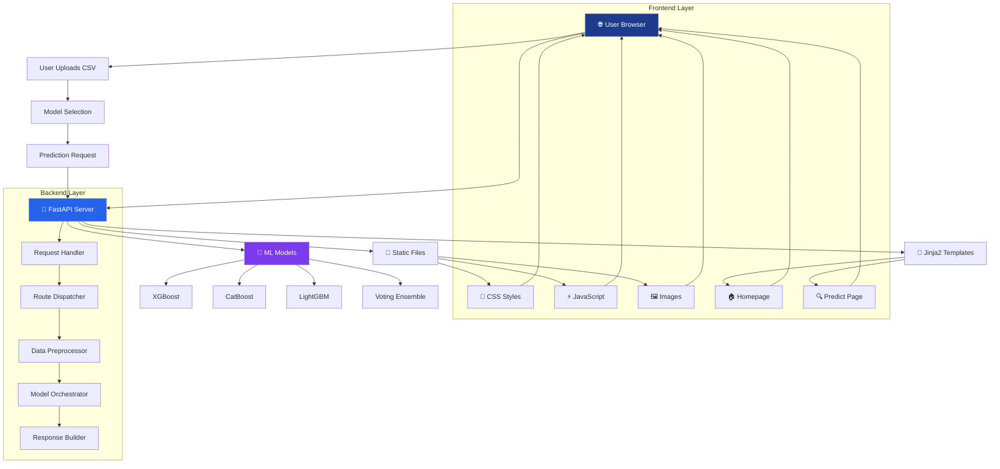

**How it works**: The architecture follows a client-server pattern where the browser interacts with FastAPI endpoints, which orchestrate ML model predictions and return structured results with visualizations.

### Request Processing Pipeline

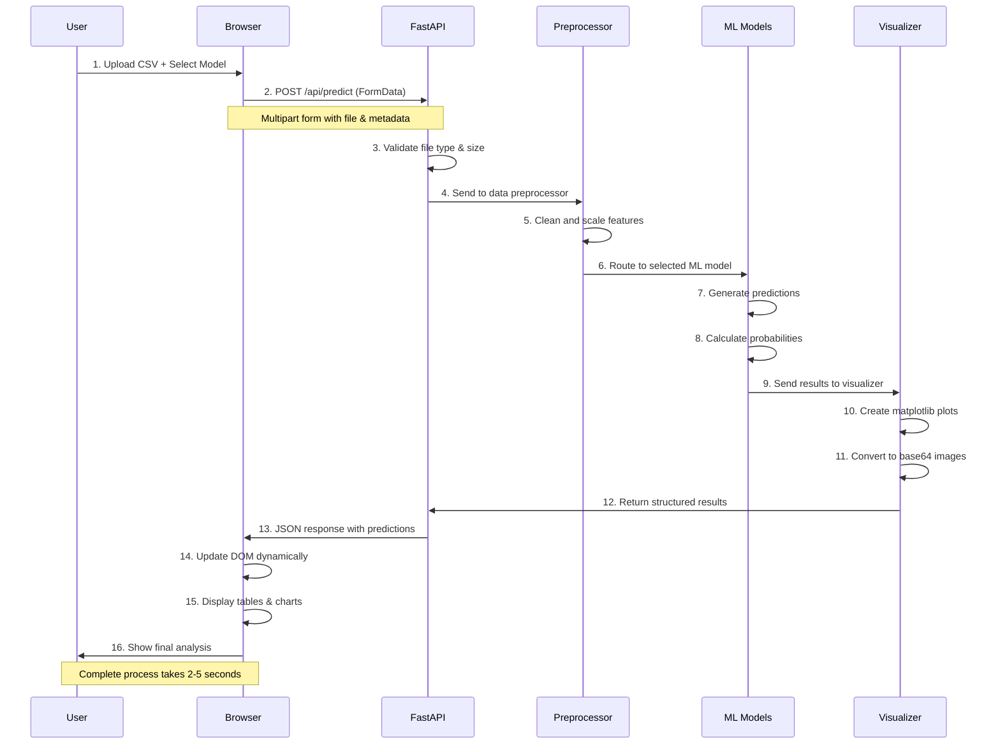

**Pipeline Explanation**: Each numbered step represents a critical stage in processing user data, from initial upload through ML inference to final visualization.

### Static Asset Delivery System

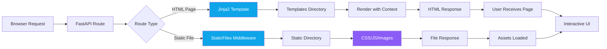

**Asset Delivery**: FastAPI efficiently serves both dynamic HTML pages and static assets through separate routing mechanisms, ensuring optimal performance.

---

## 📊 Machine Learning Pipeline

### Model Training Architecture

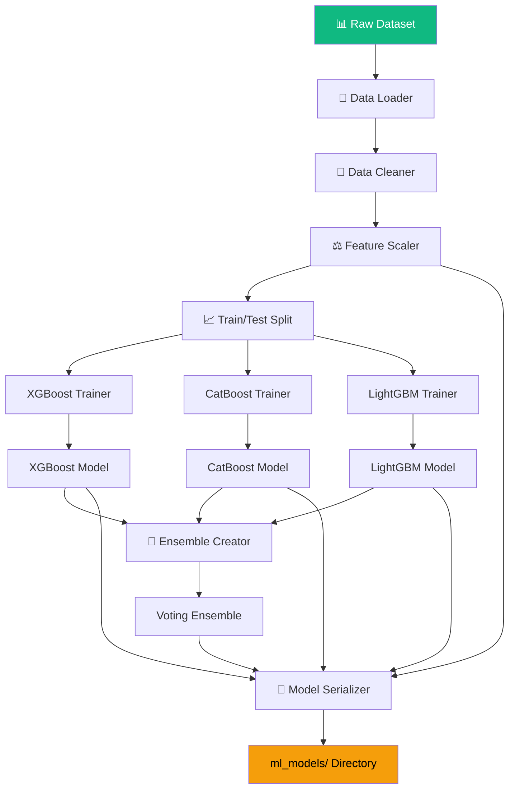

**Training Flow**: The pipeline processes astronomical data through cleaning, scaling, and splitting before training individual models and combining them into an ensemble.

### Multi-Model Prediction Workflow

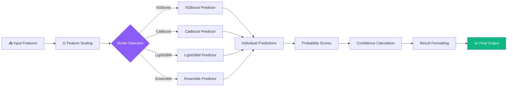

**Prediction Process**: Features are scaled consistently across all models, then routed to the selected predictor for unified result formatting.

### Model Ensemble Strategy

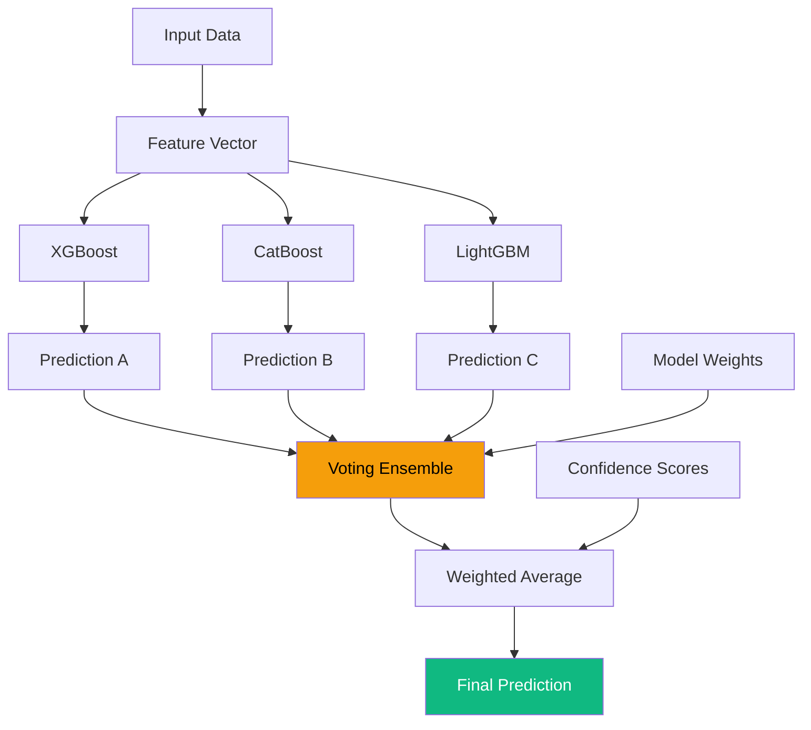

**Ensemble Mechanics**: The voting ensemble combines predictions from all three base models using optimized weighting for maximum accuracy.

---

## 🛠️ Installation & Setup

### Prerequisites
- Python 3.9 or higher
- 4GB RAM minimum
- 2GB disk space for models

### Step-by-Step Installation

```bash
# 1. Clone the repository
git clone https://github.com/your-username/spaceex.git
cd spaceex

# 2. Create virtual environment
python -m venv venv
source venv/bin/activate  # On Windows: venv\Scripts\activate

# 3. Install dependencies
pip install -r requirements.txt

# 4. Verify ML models are present
ls ml_models/
# Should show: CatBoost_best.pkl, LightGBM_best.pkl, XGBoost_best.pkl, VotingEnsemble.pkl

# 5. Launch the application
python app.py

# 6. Open browser and navigate to
# http://localhost:8000
```

### Project Structure

```
SpaceEx/
│
├── 📁 ml_models/              # Pre-trained machine learning models
│   ├── CatBoost_best.pkl      # CatBoost classifier
│   ├── LightGBM_best.pkl      # LightGBM classifier  
│   ├── XGBoost_best.pkl       # XGBoost classifier
│   ├── VotingEnsemble.pkl     # Ensemble model
│   ├── feature_names.pkl      # Feature specifications
│   ├── scaler.pkl             # Feature scaler
│   └── label_encoder.pkl      # Label encoding
│
├── 📁 static/                 # Frontend assets
│   ├── 📁 css/
│   │   └── style.css          # Space-themed styles
│   ├── 📁 js/
│   │   └── predict.js         # Frontend logic
│   └── 📁 images/
│       └── favicon.jpg        # Application icon
│
├── 📁 templates/              # HTML templates
│   ├── index.html             # Landing page
│   └── predict.html           # Prediction interface
│
├── 📁 data/                   # Example datasets
│   └── merged_unified_dataset.csv
│
├── app.py                     # FastAPI application
├── train_models.py            # Model training script
├── requirements.txt           # Python dependencies
└── README.md                  # This file
```

### Configuration

Create a `.env` file for custom settings:

```env
# Maximum file upload size (in bytes)
MAX_FILE_SIZE=10485760

# Model cache settings
MODEL_CACHE_SIZE=100

# Development settings
DEBUG=True
RELOAD=True
```

---

## 🎯 Usage Guide

### Basic Usage Flow

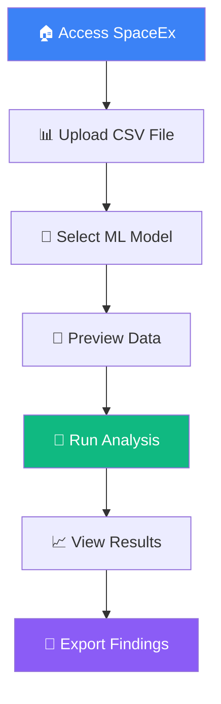

### Step-by-Step Tutorial

1. **Access the Platform**
   - Navigate to `http://localhost:8000`
   - Explore the homepage with project information

2. **Upload Your Data**
   - Click "Predict" in navigation
   - Select a CSV file with astronomical data
   - Required columns: `period`, `planet_radius`, `depth`, etc.

3. **Choose ML Model**
   - Select from four available models:
     - **XGBoost**: Fast and accurate
     - **CatBoost**: Handles categorical features well
     - **LightGBM**: Efficient with large datasets
     - **Ensemble**: Combined wisdom of all models

4. **Preview and Validate**
   - Review your data in the preview panel
   - Ensure all required features are present

5. **Run Analysis**
   - Click "Analyze Data"
   - Watch real-time progress indicators
   - Wait 2-5 seconds for results

6. **Interpret Results**
   - Review prediction statistics
   - Examine confidence scores
   - Explore interactive visualizations

### Input Data Format

Your CSV should contain these columns (example):
```csv
period,planet_radius,depth,equilibrium_temp,insolation,impact,duration,star_radius,star_mass,star_teff,kepmag
14.5,2.3,0.005,1250,45.2,0.7,3.2,1.1,1.05,5800,12.3
25.1,1.8,0.003,1100,38.7,0.5,2.8,0.9,0.95,5600,13.1
```

---

## 🔧 API Documentation

### Available Endpoints

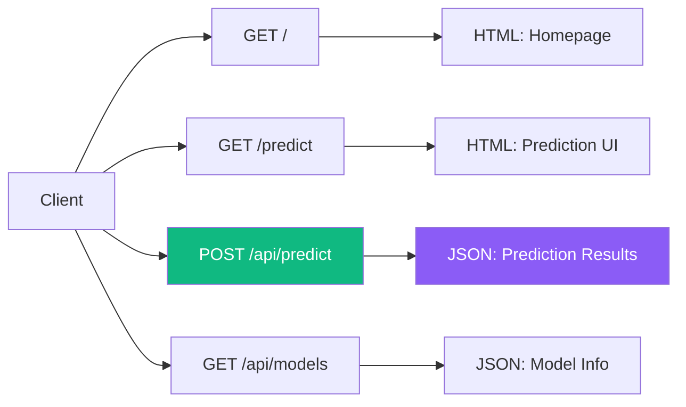

### Detailed API Specifications

#### `GET /` - Homepage
- **Purpose**: Serve the main landing page
- **Response**: HTML with project overview
- **Cache**: Browser cache enabled

#### `GET /predict` - Prediction Interface
- **Purpose**: Display the prediction form
- **Response**: HTML with file upload form
- **Features**: Model selection dropdown

#### `POST /api/predict` - Prediction Endpoint

**Request:**
```http
POST /api/predict
Content-Type: multipart/form-data

model_type: "xgboost"  # or "catboost", "lightgbm", "ensemble"
file: [CSV file]
```

**Response:**
```json
{
  "model_used": "xgboost",
  "predictions": [
    {
      "row": 1,
      "prediction": "🌍 CONFIRMED",
      "confidence": 0.894,
      "probabilities": {
        "false_positive": 0.043,
        "candidate": 0.063,
        "confirmed": 0.894
      }
    }
  ],
  "statistics": {
    "total_predictions": 50,
    "confirmed_count": 12,
    "confirmed_percentage": 24.0
  },
  "visualizations": {
    "prediction_plot": "data:image/png;base64,..."
  }
}
```

#### `GET /api/models` - System Information
- **Purpose**: Get loaded model status
- **Response**: JSON with model metadata
- **Use Case**: Health checks and monitoring

---

## 📈 Model Performance

### Accuracy Comparison

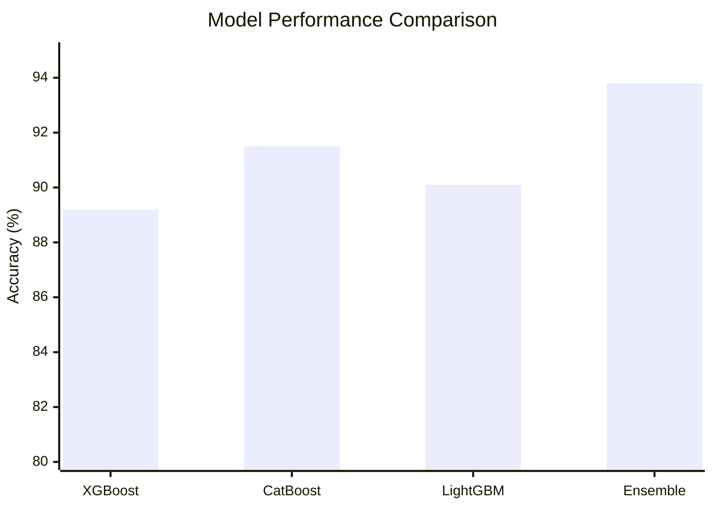

### Feature Importance Analysis

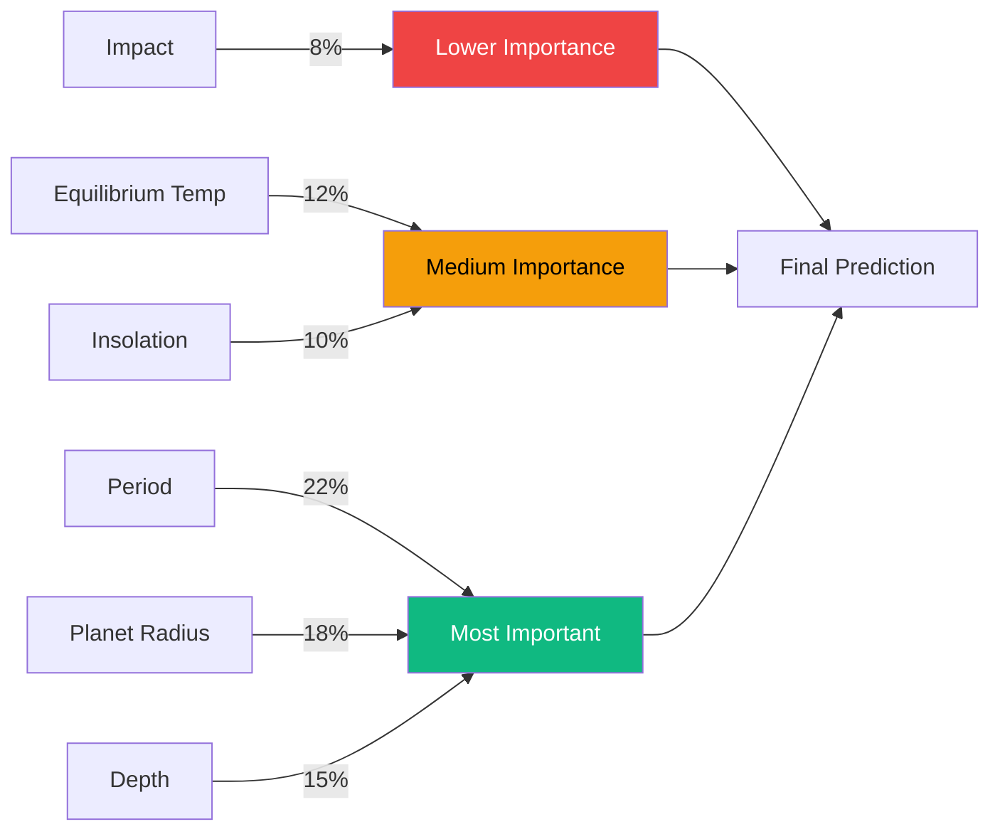

### Confidence Distribution

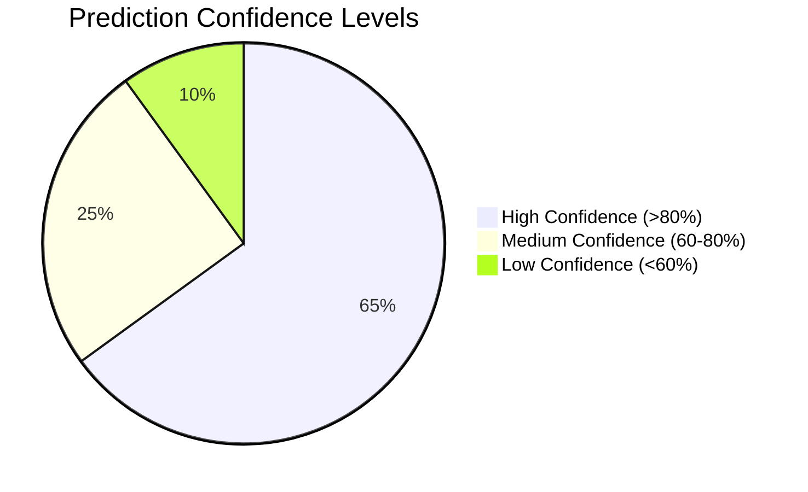

---

## 👥 Development Team

### Core Contributors

| Role | Name | Contribution |
|------|------|--------------|
| **Project Lead** | Dhruvil | System Architecture & Backend |
| **ML Engineer** | Krisha | Model Development & Training |
| **Frontend Developer** | Vraj | UI/UX Design & Implementation |
| **Data Scientist** | Parth | Data Processing & Analysis |
| **DevOps Engineer** | Akshat | Deployment & Optimization |

### Development Workflow

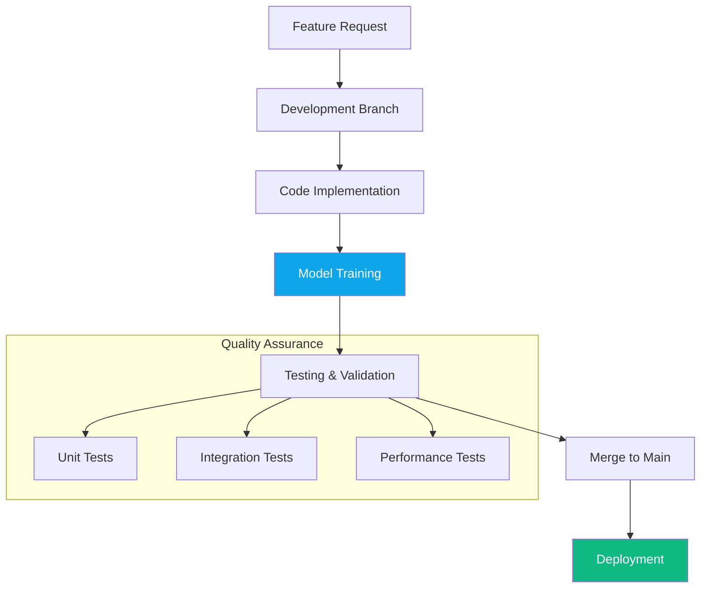

---

## 🤝 Contributing

We welcome contributions from the community! Here's how you can help:

### Development Setup
```bash
# 1. Fork the repository
# 2. Clone your fork
git clone https://github.com/your-username/spaceex.git

# 3. Create feature branch
git checkout -b feature/amazing-feature

# 4. Make changes and test
python test_models.py

# 5. Commit and push
git commit -m "Add amazing feature"
git push origin feature/amazing-feature

# 6. Create Pull Request
```

### Areas for Contribution
- 🔍 New ML model implementations
- 📊 Additional visualization types
- 🌐 Internationalization (i18n)
- 📱 Mobile app development
- 🔧 Performance optimizations

---

## 📄 License

This project is licensed under the MIT License - see the [LICENSE](LICENSE) file for details.

### Acknowledgments
- NASA Exoplanet Archive for dataset inspiration
- FastAPI community for excellent documentation
- Scikit-learn team for robust ML tools

---

<div align="center">

**🌟 Discover the cosmos one prediction at a time with SpaceEx 🌟**

[Report Bug](https://github.com/your-username/spaceex/issues) • 
[Request Feature](https://github.com/your-username/spaceex/issues) • 
[View Demo](http://your-demo-link.com)

</div>

## 🔗 Additional Resources

### Documentation
- [FastAPI Documentation](https://fastapi.tiangolo.com)
- [Scikit-learn User Guide](https://scikit-learn.org/stable/user_guide.html)
- [Matplotlib Tutorials](https://matplotlib.org/stable/tutorials/index.html)

### Related Projects
- [NASA Exoplanet Archive](https://exoplanetarchive.ipac.caltech.edu)
- [LightCurve Analysis Tools](https://github.com/lightcurve-tools)
- [AstroML Library](https://www.astroml.org)


---

*SpaceEx: Where artificial intelligence meets astronomical discovery* 🚀🌌